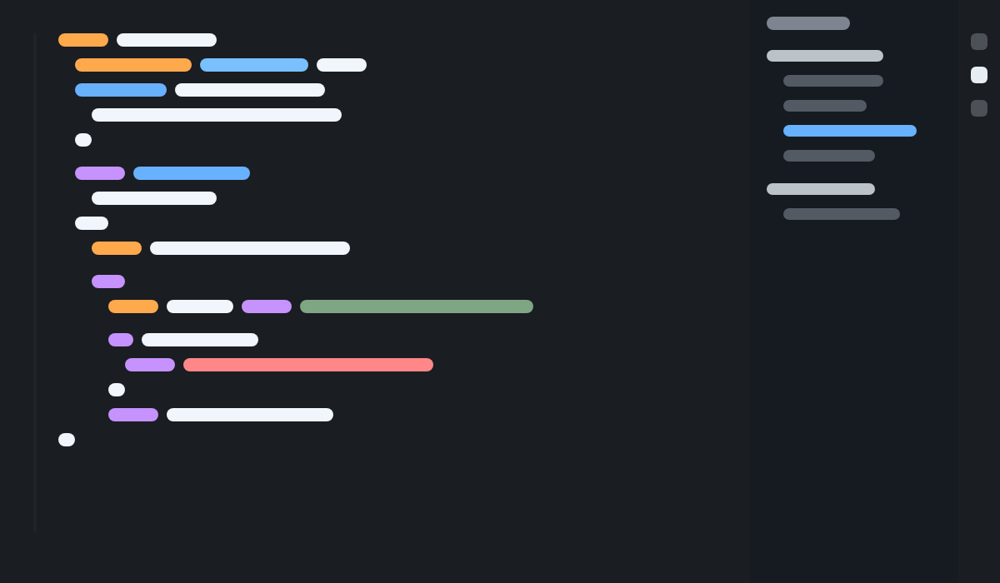

# Arctic Night Theme 🌌

A minimal dark theme for Visual Studio Code, inspired by the deep, calm night sky of the Arctic.



## Features

- **Deep Arctic Background**: A soothing dark slate background (`#1a1d21`) that is easy on the eyes.
- **Cool Blue Accents**: A carefully curated palette of blues (`#58a6ff`, `#79c0ff`) for a modern, frosty look.
- **Monochromatic & Minimal**: Reduced visual noise for better focus.
- **Semantic Highlighting**: Full support for modern semantic syntax highlighting.

## Installation

1. Open **Extensions** sidebar in VS Code.
2. Search for `Arctic Night`.
3. Click **Install**.
4. Press `Ctrl+K Ctrl+T` and select **Arctic Night**.

## Recommended Settings

For the best experience, we recommend these settings:

```json
{
  "editor.renderLineHighlight": "gutter",
  "editor.fontFamily": "'JetBrains Mono', Consolas, 'Courier New', monospace",
  "workbench.colorCustomizations": {
    "[Arctic Night]": {
      "editor.lineHeight": 1.6
    }
  }
}
```

## Contributing

Issues and Pull Requests are welcome!

## License

MIT
